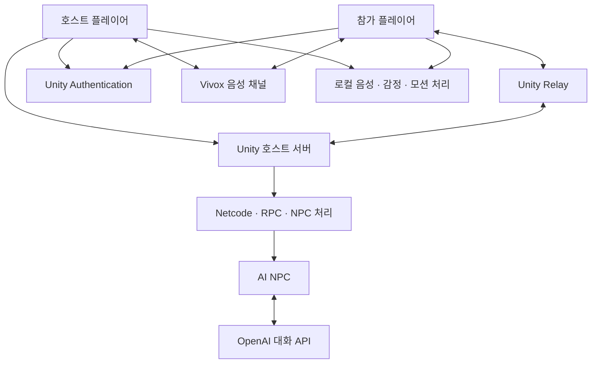
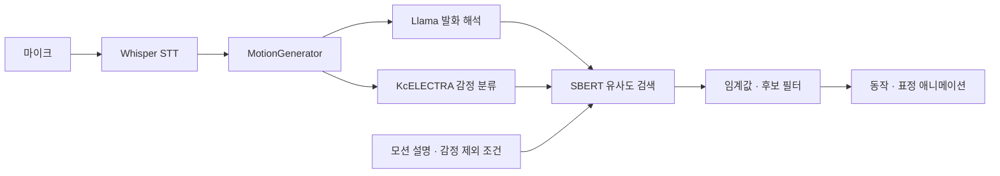

# Metamong

**음성·텍스트 대화를 아바타의 동작과 표정으로 연결하는 Unity 멀티플레이어 프로젝트입니다.**

플레이어는 같은 공간에 접속해 이동하고, 채팅하거나 음성으로 대화할 수 있습니다. AI는 발화의 의미와 감정을 해석해 준비된 애니메이션 중 동작·표정을 선택합니다. Unity 플레이어, 호스트 서버, 네트워크 동기화, 음성 채팅, AI NPC를 하나의 프로젝트에 구성했습니다.

## 주요 기능

| 영역 | 기능 |
| --- | --- |
| Unity 플레이어 | 이동·점프, 마우스 시점 조작, 1인칭·3인칭 전환, 이름표·애니메이션 |
| 멀티플레이어 | 호스트 세션 생성, 참가 코드로 접속, 플레이어 오브젝트·상태 동기화 |
| 서버·네트워크 | Unity 호스트의 서버 역할, Relay 연결, ServerRpc·ClientRpc 메시지 전달 |
| 텍스트 채팅 | 주변 대상에게 메시지 전달, 채팅 로그·말풍선 표시, NPC 대화 연결 |
| 음성 채팅 | Vivox 채널 참여, 참가자·발화 상태 표시, 입력·출력 장치와 볼륨 설정 |
| AI 모션 선택 | Whisper 음성 인식, Llama 발화 해석, SBERT 검색, 감정·유사도 조건 적용 |
| 감정 표현 | KcELECTRA 감정 분류, 동작·표정 애니메이션 연결 |
| AI NPC | 플레이어 감지·바라보기, 대화 응답 생성, 응답 모션·대기 애니메이션 |
| 실행 상태·로그 | 처리 단계별 상태, 대기 세그먼트, 타임아웃·취소, 타임라인 기록 |

## 전체 구조



서버 로직은 `client/Metamong` 내부의 Unity Netcode 호스트로 실행합니다. `StartHost()`가 서버와 로컬 플레이어를 함께 시작하고, 참가자는 `StartClient()`로 접속합니다. 별도의 웹 백엔드나 전용 서버 실행 프로젝트는 포함되어 있지 않습니다.

### Unity 플레이어와 애니메이션

- `PlayerController`는 자신이 소유한 캐릭터의 이동·점프·입력을 처리합니다. 채팅 입력 중에는 이동·점프 입력을 제한합니다.
- `CameraController`는 마우스 회전과 1인칭·3인칭 시점을 관리합니다.
- `AvatarAnimation`은 걷기·점프·대화 상태와 동작·표정 클립을 제어합니다.
- `ClientNetworkTransform`과 `OwnerNetworkAnimator`는 소유자 측에서 위치·애니메이션을 제어하는 동기화 구성을 제공합니다.

### 호스트 서버와 접속

1. 로비에서 이름과 호스트·참가자 역할을 선택합니다.
2. Unity Services 초기화·익명 인증·Vivox 로그인을 진행합니다.
3. `InGame` 씬으로 전환합니다.
4. 호스트는 Relay 할당·참가 코드를 생성하고 `StartHost()`를 호출합니다.
5. 참가자는 같은 코드로 Relay에 참여하고 `StartClient()`를 호출합니다.

`RelayUtils`의 할당 설정은 `m_MaxConnections = 4`이며 전송 설정은 DTLS를 사용합니다. 이는 코드의 설정값입니다.

### 채팅과 음성 통신

**게임 내 채팅**은 `PacketSendHandler → RpcManager → ServerPacketReceiveHandler → PacketReceiveHandler` 경로로 전달됩니다. 서버가 대상 클라이언트에 메시지를 보내고, NPC 같은 비클라이언트 대상에는 `IListenable` 인터페이스로 전달합니다. 결과는 채팅 로그와 말풍선에 표시합니다.

**음성 채팅**은 Vivox를 사용합니다. 기본 접속 경로는 참가 코드를 채널 이름으로 사용하는 그룹 채널이며 텍스트·오디오를 함께 활성화합니다. 위치 기반 3D 음성 채널 함수도 별도로 포함합니다. UI에서 입력·출력 장치, 볼륨, 참가자와 발화 상태를 관리합니다.

## AI 파이프라인



- **Whisper:** 발화 세그먼트를 텍스트로 변환합니다.
- **Llama:** LLMUnity를 통해 모션 검색용 문장을 구성합니다.
- **KcELECTRA:** Sentis에서 `kcElectra_emotion` 모델을 실행해 공포·놀람·분노·슬픔·중립·행복·혐오 중 하나를 반환합니다.
- **SBERT:** 모션 설명을 사전 임베딩하고 코사인 유사도로 비교합니다. 임베딩 캐시, 감정 제외 조건, 플레이어·NPC별 임계값을 적용합니다.
- **MotionGenerator:** LLM 처리 중 대기 세그먼트, 타임아웃·취소, 모션 실행 상태를 관리합니다.

SBERT·감정 분류의 Sentis Worker는 CPU 백엔드를 사용합니다. 기존 모션을 선택·재생하는 구조이며, 새로운 애니메이션을 생성하는 모델은 아닙니다.

### AI NPC

NPC는 서버 측에서 플레이어를 감지하고 대화 상대를 바라봅니다. 메시지를 받으면 OpenAI 대화 API로 응답을 생성하고, 응답 문장을 모션 선택 흐름에 연결합니다. 대화 이력·요약, 응답 간격 제어, 대화 종료·대기 애니메이션 코드도 포함합니다.

플레이어 발화 해석의 **로컬 Llama**와 NPC 응답의 **OpenAI API**는 별도 경로입니다.

## 프로젝트 구성

```text
client/Metamong/
├── Assets/
│   ├── Scenes/Multi_Test/Network/   # Lobby, InGame
│   ├── Scripts/
│   │   ├── Entities/Player/        # 플레이어·모션·애니메이션
│   │   ├── Entities/AI_NPC/        # NPC·대화 API
│   │   ├── Controllers/           # 카메라·NPC 동작
│   │   ├── Managers/              # 접속·RPC·씬·채팅·STT·LLM
│   │   ├── Network/               # 패킷·수신 처리·동기화
│   │   ├── MotionMapping/         # SBERT·모션 JSON·ONNX 변환
│   │   ├── Emotion/               # 감정 분류
│   │   ├── Vivox/                 # 음성 채널
│   │   ├── UI/                    # 채팅·장치·음성 상태
│   │   └── Utils/                 # 인증·Relay·로그
│   ├── Resources/                 # ONNX·토크나이저·캐릭터
│   └── StreamingAssets/           # 모델 리소스
├── Packages/
└── ProjectSettings/
```

## 개발 환경

| 구성 | 버전·기술 |
| --- | --- |
| Unity Editor | 2022.3.55f1 |
| 언어 | C#, Python(모델 변환 도구) |
| 멀티플레이어 | Netcode for GameObjects 1.11.0, Unity Transport 2.0.1 |
| 접속 서비스 | Authentication 2.0.0, Relay 1.2.0 |
| 음성 채팅 | Vivox 16.5.4 |
| AI 추론 | Sentis 2.1.2, ONNX, Whisper Unity, LLMUnity |
| NPC 대화 | OpenAI Chat Completions API |
| UI | Unity UI, TextMeshPro |

패키지는 [manifest.json](client/Metamong/Packages/manifest.json)을 기준으로 합니다.

## 실행 방법

### 1. 프로젝트 준비

```bash
git clone https://github.com/chanrhan/Metamong.git
```

Unity Hub에서 `client/Metamong`을 Unity **2022.3.55f1**로 엽니다. 패키지를 복원하고 Unity 프로젝트에 Authentication·Relay·Vivox 서비스를 설정합니다.

### 2. 모델과 설정 준비

| 항목 | 준비 사항 |
| --- | --- |
| SBERT | `Assets/Resources/model.onnx`, `KR_SBERT_vocab.txt` 확인 |
| 감정 분류 | `Assets/Resources/kcElectra_emotion.onnx` 준비. 현재 저장소에는 `.meta`만 포함 |
| 로컬 LLM | 프로젝트에 맞는 GGUF 가중치를 준비해 LLMUnity 컴포넌트에 연결. 현재 저장소에 GGUF 본체는 없음 |
| Whisper | `Assets/StreamingAssets/ggml-tiny.bin`, WhisperManager·마이크 설정 확인 |
| NPC 대화 | `OPENAI_API_KEY` 환경 변수와 모델 설정 확인. 코드의 기본 모델명은 `gpt-4o` |
| 모션 데이터 | `Scripts/MotionMapping`의 JSON, Animator·프리팹 참조 확인 |

NPC API 키는 실행 환경에 설정합니다. Unity Hub·Editor가 환경 변수를 읽을 수 있도록 설정 후 다시 실행합니다.

### 3. 호스트·참가자 실행

1. `Assets/Scenes/Multi_Test/Network/Lobby.unity`를 엽니다.
2. 호스트 인스턴스에서 이름을 입력하고 호스트 로그인 버튼을 선택합니다.
3. 인게임 화면에 표시된 참가 코드를 확인합니다.
4. 다른 인스턴스에서 이름·참가 코드를 입력하고 참가자 로그인 버튼을 선택합니다.
5. 같은 세션에서 플레이어 표시·채팅·음성 장치를 확인합니다.

Player 빌드에는 `Lobby.unity`와 `InGame.unity`를 포함합니다. 두 씬은 [EditorBuildSettings.asset](client/Metamong/ProjectSettings/EditorBuildSettings.asset)에 등록되어 있습니다. 호스트 실행 인스턴스가 서버 역할을 담당합니다.

### 기본 조작

| 입력 | 동작 |
| --- | --- |
| Horizontal / Vertical | 캐릭터 이동 · Input Manager 설정 사용 |
| Jump | 접지 상태에서 점프 · Input Manager 설정 사용 |
| 마우스 | 시점 회전 |
| `1` / `2` | 1인칭 / 3인칭 전환 |
| `Esc` | 커서 표시·잠금 전환 |
| `T` | 키를 놓을 때 STT 녹음 시작·종료 전환 |
| 채팅 입력창 | 메시지 입력·전송 |

`T`는 STT 녹음 제어이며, Vivox 채널 음소거와는 별개입니다.

## 주요 코드

| 영역 | 진입점 |
| --- | --- |
| 플레이어 | [PlayerController.cs](client/Metamong/Assets/Scripts/Entities/Player/PlayerController.cs), [AvatarAnimation.cs](client/Metamong/Assets/Scripts/Entities/Player/AvatarAnimation.cs) |
| 서버·연결 | [CustomNetworkManager.cs](client/Metamong/Assets/Scripts/Managers/CustomNetworkManager.cs), [RelayUtils.cs](client/Metamong/Assets/Scripts/Utils/RelayUtils.cs) |
| 메시지 전달 | [RpcManager.cs](client/Metamong/Assets/Scripts/Managers/RpcManager.cs), [ServerPacketReceiveHandler.cs](client/Metamong/Assets/Scripts/Network/Handlers/ServerPacketReceiveHandler.cs) |
| 음성 채팅 | [VivoxManager.cs](client/Metamong/Assets/Scripts/Vivox/VivoxManager.cs), [AudioDeviceSettings.cs](client/Metamong/Assets/Scripts/UI/AudioDeviceSettings.cs) |
| AI NPC | [NpcAI.cs](client/Metamong/Assets/Scripts/Entities/AI_NPC/NpcAI.cs), [ChatCompletionWithSummary.cs](client/Metamong/Assets/Scripts/Entities/AI_NPC/ChatCompletionWithSummary.cs) |
| 음성·모션 | [STTManager.cs](client/Metamong/Assets/Scripts/Managers/STTManager.cs), [MotionGenerator.cs](client/Metamong/Assets/Scripts/Entities/Player/MotionGenerator.cs) |
| 검색·감정 | [SBERT.cs](client/Metamong/Assets/Scripts/MotionMapping/SBERT.cs), [EmotionClassifier.cs](client/Metamong/Assets/Scripts/Emotion/EmotionClassifier.cs) |

## 실행 시 참고

- 모델 파일과 Unity 서비스 설정이 필요하므로 클론 직후 전체 기능이 바로 실행되지는 않습니다.
- 현재 STT 코드에는 macOS에서 실행을 건너뛰는 분기가 있습니다.
- 모션 JSON은 `Application.dataPath` 아래 소스 경로를 읽습니다. Player 빌드 배포 시 파일 포함 위치와 로딩 경로를 확인해야 합니다.
- 문서는 main의 소스와 설정을 기준으로 작성했습니다. Unity 빌드·멀티플레이 접속·모델 추론은 별도 실행 검증이 필요합니다.
