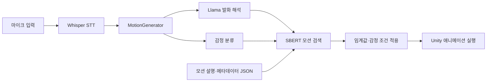

# Metamong

음성을 텍스트로 변환하고, 발화의 의미와 감정을 해석해 Unity 아바타의 동작·표정을 선택하는 졸업작품입니다. 미리 준비된 애니메이션과 문장 설명을 연결해 대화에 맞는 모션을 재생합니다.

한국기술교육대학교 2025학년도 졸업작품 · **박희찬, 강윤민, 안주현, 이수성**

## 주요 기능

- **음성 입력:** Whisper 스트림의 음성 인식 세그먼트를 모션 처리로 전달합니다.
- **발화 해석:** LLMUnity의 Llama 호출로 발화를 모션 검색에 사용할 문장으로 정리합니다.
- **감정 분류:** Sentis로 감정 모델을 실행하고 7개 레이블 중 하나를 선택합니다. 현재 코드의 모델 리소스명은 `kcElectra_emotion`입니다.
- **모션 검색:** SBERT 임베딩과 코사인 유사도로 동작·표정 사전에서 후보를 고릅니다.
- **후보 제어:** 감정 제외 목록과 플레이어/NPC별 유사도 임계값을 적용합니다.
- **실행과 관찰:** 선택 결과를 애니메이션 실행에 연결하고 대기 세그먼트·타임아웃·단계별 로그를 관리합니다.

## 처리 구조



이 그림은 데이터 흐름을 나타냅니다. 모든 단계가 병렬로 실행된다는 의미는 아닙니다.

## 코드 읽기 안내

아래 링크에서 main의 주요 구현을 확인할 수 있습니다.

| 구현 | 파일 | 확인할 내용 |
| --- | --- | --- |
| STT 연결 | [STTManager.cs](https://github.com/chanrhan/Metamong/blob/main/client/Metamong/Assets/Scripts/Managers/STTManager.cs) | 마이크·Whisper 스트림 생성, 세그먼트 이벤트 |
| 전체 처리 제어 | [MotionGenerator.cs](https://github.com/chanrhan/Metamong/blob/main/client/Metamong/Assets/Scripts/Entities/Player/MotionGenerator.cs) | LLM 호출, 감정·모션 결과 연결, 취소·대기 처리 |
| 모션 검색 | [SBERT.cs](https://github.com/chanrhan/Metamong/blob/main/client/Metamong/Assets/Scripts/MotionMapping/SBERT.cs) | 사전 임베딩 계산·캐시, 감정 후보 제외, 유사도 임계값 |
| 감정 분류 | [EmotionClassifier.cs](https://github.com/chanrhan/Metamong/blob/main/client/Metamong/Assets/Scripts/Emotion/EmotionClassifier.cs) | 토큰화, ONNX 추론, 7개 감정 레이블 |
| 문장 해석 | [Llama.cs](https://github.com/chanrhan/Metamong/blob/main/client/Metamong/Assets/Scripts/Managers/Llama.cs) | 발화·대화 문맥 구성과 LLMUnity 호출 |
| 모션 데이터 | [ActMotionInfo.json](https://github.com/chanrhan/Metamong/blob/main/client/Metamong/Assets/Scripts/MotionMapping/ActMotionInfo.json) | 모션별 설명·감정 제외 정보 |

`SBERTMotionMapper.cs`는 `[Obsolete]`로 표시되어 있습니다. 통합 흐름은 `MotionGenerator.cs`와 `SBERT.cs`부터 읽는 것이 좋습니다.

## 개발 환경과 실행 준비

- Unity **2022.3.55f1**
- Unity Sentis **2.1.2**, Netcode for GameObjects **1.11.0**, Vivox **16.5.4** (프로젝트 패키지 설정 기준)
- C#, ONNX, Whisper Unity, LLMUnity
- Python ONNX 변환 실험 스크립트는 `Assets/Scripts/MotionMapping/ModelExporter`에 있습니다.

```bash
git clone --branch main https://github.com/chanrhan/Metamong.git
```

1. Unity Hub에서 `client/Metamong`을 프로젝트로 엽니다.
2. 해당 Unity 버전으로 패키지를 복원합니다.
3. 모델 리소스와 씬의 컴포넌트 참조를 확인합니다.
4. 네트워크 데모는 Unity 서비스 설정과 마이크 장치를 준비합니다.
5. Build Settings에 등록된 `Assets/Scenes/Multi_Test/Network/Lobby.unity`와 `InGame.unity`를 확인합니다.

### 별도로 확인할 리소스

| 항목 | 코드가 기대하는 위치·상태 |
| --- | --- |
| SBERT 모델 | `Assets/Resources/model.onnx` 로드 |
| 토크나이저 | `Assets/Resources/KR_SBERT_vocab.txt` |
| 감정 모델 | `Assets/Resources/kcElectra_emotion.onnx` 필요. 분석 커밋에는 `.meta`만 확인됨 |
| LLM 가중치 | 분석 커밋에 GGUF 파일 본체는 확인되지 않음. 프로젝트에서 사용한 파일과 Inspector 설정 필요 |
| Whisper | `StreamingAssets/ggml-tiny.bin` 파일과 Whisper 컴포넌트 설정 확인 |
| 모션 JSON | `Application.dataPath + /Scripts/MotionMapping/` 아래 파일을 읽음. 빌드 배포 시 경로 점검 필요 |

클론만으로 전체 실행이 준비되는 상태는 아닙니다. 모델·Unity 서비스·씬 설정을 갖춘 환경에서 실행을 검증해야 합니다.

## 구현 범위와 실험 기록

안주현은 AI 파트를 담당했으며, KoBERT·SBERT 등의 학습 방식 비교 실험 후 감정 분류 모델을 KcELECTRA로 교체했습니다. 이는 담당자 확인 내용이며, 현재 저장소의 추론·통합 코드와 학습 실험 산출물은 구분합니다.

Full Fine-tuning·LoRA 비교의 학습 스크립트, W&B 실행 링크, 전체 응답 지연 측정 결과는 이 README의 재현 근거로 포함하지 않았습니다. ONNX 변환 실험 스크립트만으로 학습 결과나 현재 배포 모델의 생성 과정을 재현할 수 있다고 주장하지 않습니다.

이번 문서는 소스·패키지·모델 파일 목록을 대조해 작성했습니다. Unity 빌드, 모델 추론, 음성 입력과 네트워크 데모의 실행 테스트는 수행하지 않았습니다.
